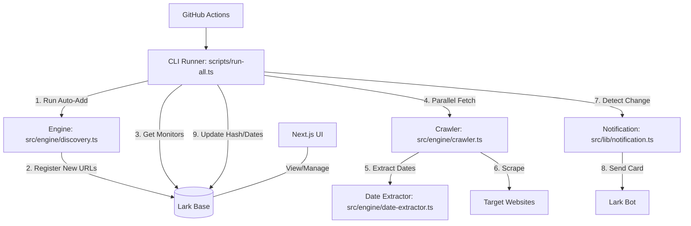

# Website Update Monitoring

特定のWebサイトの指定された箇所（CSSセレクタ）を定期的に監視し、更新があった場合に Lark (Feishu) に通知するツールです。

## 特徴

- **URL自動追加 (URL Auto-Add)**: Amazonなどのイベントページを巡回し、新しいセールのURLを自動的に検出して監視リストに登録します。
- **日付抽出 (Date Extraction)**: ページ内のテキストを解析し、セールの開始日・終了日を `yyyy-mm-dd` 形式で自動抽出します。
- **ハイブリッドな監視体制**: 
    - 管理UIは Next.js (Vercel) で提供
    - 実際の重い監視処理は GitHub Actions で実行（タイムアウト制限なし）
- **堅牢なスクレイピング**: 
    - 静的ページは Axios + Cheerio で高速処理
    - JavaScript レンダリングが必要なページは Puppeteer で自動対応
- **Lark 連携**:
    - **設定管理**: 監視対象や自動追加設定は Lark Base (BitTable) で管理。
    - **通知**: 更新検知時にリッチな Lark カード形式で通知。

## アーキテクチャ



### 主要コンポーネント
- **`scripts/run-all.ts`**: GitHub Actions から実行されるメインランナー。自動発見と監視チェックを一括実行。
- **`src/engine/discovery.ts`**: 新しいリンクを自動で見つけるためのエンジン。
- **`src/engine/date-extractor.ts`**: 日本語の日付表現を機械可読な形式に変換。
- **`src/engine/crawler.ts`**: 静的・動的ページを賢く使い分けてコンテンツを取得。

## 技術スタック

- **Framework**: Next.js 16 (App Router)
- **Language**: TypeScript
- **Crawling**: Axios + Cheerio (静的ページ), Puppeteer (JavaScript レンダリングページ)
- **Database**: Lark Base (BitTable)
- **Notification**: Lark Bot (Interactive Cards)

## 環境変数

以下の環境変数を設定してください（Vercel の Environment Variables など）。

| 変数名 | 説明 | 必須 |
| :--- | :--- | :--- |
| `LARK_APP_ID` | Lark アプリの App ID | ✅ |
| `LARK_APP_SECRET` | Lark アプリの App Secret | ✅ |
| `LARK_NOTIFY_CHAT_ID` | 通知送り先のチャットID (or Open ID) | ✅ |
| `LARK_BASE_URL` | Lark Base の URL (ここから全てのIDを抽出) | ✅ (推奨) |
| `CRON_SECRET` | `/api/cron` 実行時の認証キー | ✅ (推奨) |

> [!TIP]
> `LARK_BASE_URL` を設定すると、そこから `LARK_BASE_ID` と `LARK_TABLE_ID` が自動的に抽出されます。個別の ID 設定は不要になります。

## 事前準備: Lark Base のフィールド追加

エラー状態を UI に表示するため、Lark Base のテーブルに以下の **2つのフィールドを手動で追加** してください。

1.  **`Status`**: 「テキスト」または「単一選択」
    - 成功時に `OK`、失敗時に `Error` が書き込まれます。
2.  **`ErrorMessage`**: 「テキスト」
    - 失敗時のエラー内容が書き込まれます。

## 使い方

### 1. UI での操作
- **監視の追加**: ダッシュボードのフォームから URL と セレクタを入力して登録します。
- **Base と同期**: Lark Base 側で直接追加したレコードを UI に反映させるには、画面右上の「Base と同期」ボタンを押してください。

### 2. 定期実行 (GitHub Actions)
Vercel の実行制限に関わらず安定した監視を行うため、**GitHub Actions** での実行を前提としています。

#### GitHub Secrets の設定
リポジトリの `Settings > Secrets and variables > Actions` に以下を登録してください。

- `LARK_APP_ID`: Lark アプリの ID
- `LARK_APP_SECRET`: Lark アプリの Secret
- `LARK_BASE_URL`: Lark Base の全体URL
- `LARK_NOTIFY_CHAT_ID`: 通知先の ID

設定後、`.github/workflows/monitor.yml` に基づいて毎日自動実行されます。

### 3. API 直接実行
`GET /api/cron?secret=YOUR_CRON_SECRET` を叩くことで、手動で一括チェックを起動できます。

## セットアップ

### インストール
```bash
pnpm install
```

### 開発サーバーの起動
```bash
pnpm dev
```

### ビルド
```bash
pnpm build
```
