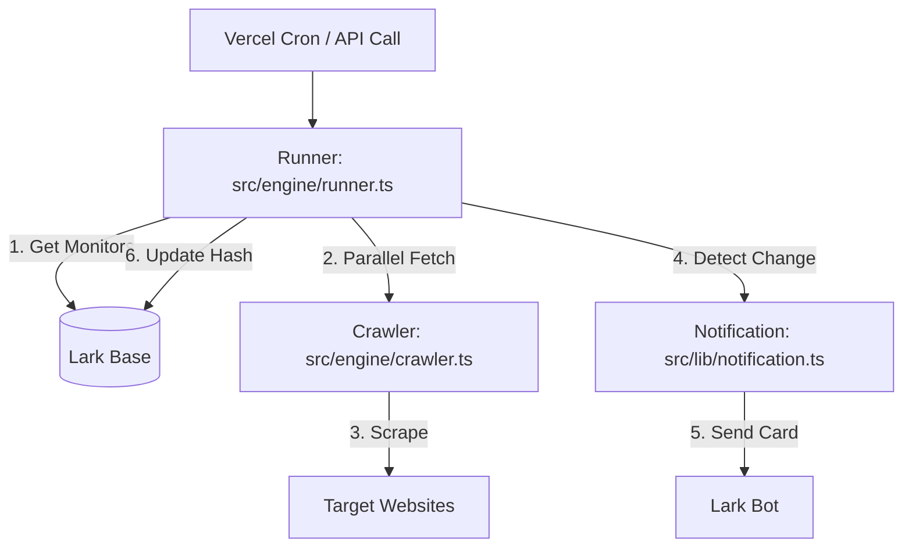

# Website Update Monitoring

特定のWebサイトの指定された箇所（CSSセレクタ）を定期的に監視し、更新があった場合に Lark (Feishu) に通知するツールです。

## 特徴

- **特定箇所の監視**: URLとCSSセレクタを指定することで、ページ全体の更新ではなく、特定のコンテンツ（例: ニュースリスト、価格など）の変更のみを検知します。
- **並列高速チェック**: 複数の監視対象を同時にチェックするため、対象数が増えても短時間で処理が完了します。
- **堅牢なスクレイピング**: タイムアウト設定とUser-Agentの偽装により、接続エラーやブロックを最小限に抑えます。
- **Lark 連携**:
    - **設定管理**: 監視対象のリストは Lark Base (BitTable) で管理。UIからも直接編集可能。
    - **通知**: 更新検知時にリッチな Lark カード形式で通知。

## アーキテクチャ



### 主要コンポーネント
- **`src/engine/runner.ts`**: 全体の中核ロジック。`Promise.allSettled` による並列処理を制御。
- **`src/engine/crawler.ts`**: Axios + Cheerio を使用。10秒のタイムアウトとブラウザヘッダーを実装。
- **`src/lib/notification.ts`**: Lark 通知カードの構築と送信を担当。
- **`src/lib/lark.ts`**: Lark SDK を使用したデータの読み書き。

## 技術スタック

- **Framework**: Next.js 16 (App Router)
- **Language**: TypeScript
- **Crawling**: Axios, Cheerio
- **Database**: Lark Base (BitTable)
- **Notification**: Lark Bot (Interactive Cards)

## 環境変数

以下の環境変数を設定してください（Vercel の Environment Variables など）。

| 変数名 | 説明 | 必須 |
| :--- | :--- | :--- |
| `LARK_APP_ID` | Lark アプリの App ID | ✅ |
| `LARK_APP_SECRET` | Lark アプリの App Secret | ✅ |
| `LARK_NOTIFY_CHAT_ID` | 通知送り先のチャットID (or Open ID) | ✅ |
| `LARK_BASE_URL` | Lark Base の URL (ここから全てのIDを抽出) | ✅ (推奨) |
| `CRON_SECRET` | `/api/cron` 実行時の認証キー | ✅ (推奨) |

> [!TIP]
> `LARK_BASE_URL` を設定すると、そこから `LARK_BASE_ID` と `LARK_TABLE_ID` が自動的に抽出されます。個別の ID 設定は不要になります。

## 事前準備: Lark Base のフィールド追加

エラー状態を UI に表示するため、Lark Base のテーブルに以下の **2つのフィールドを手動で追加** してください。

1.  **`Status`**: 「テキスト」または「単一選択」
    - 成功時に `OK`、失敗時に `Error` が書き込まれます。
2.  **`ErrorMessage`**: 「テキスト」
    - 失敗時のエラー内容が書き込まれます。

## 使い方

### 1. UI での操作
- **監視の追加**: ダッシュボードのフォームから URL と セレクタを入力して登録します。
- **Base と同期**: Lark Base 側で直接追加したレコードを UI に反映させるには、画面右上の「Base と同期」ボタンを押してください。

### 2. 定期実行 (GitHub Actions) ★推奨
Vercel の Hobby プランでは Cron ジョブが 1日1回に制限されているため、**GitHub Actions** を使用して 1時間（またはそれ以上）おきに実行することを推奨します。

#### GitHub Secrets の設定
リポジトリの `Settings > Secrets and variables > Actions` に以下を登録してください。

- `VERCEL_APP_URL`: デプロイした Vercel の URL (例: `https://your-app.vercel.app`)
- `CRON_SECRET`: Vercel 側に設定した `CRON_SECRET` と同じ値

設定後、`.github/workflows/cron.yml` に基づいて自動実行が開始されます。

### 3. API 直接実行
`GET /api/cron?secret=YOUR_CRON_SECRET` を叩くことで、手動で一括チェックを起動できます。

## セットアップ

### インストール
```bash
pnpm install
```

### 開発サーバーの起動
```bash
pnpm dev
```

### ビルド
```bash
pnpm build
```
